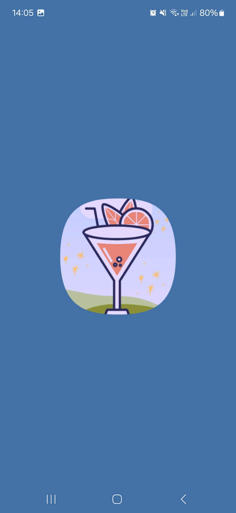
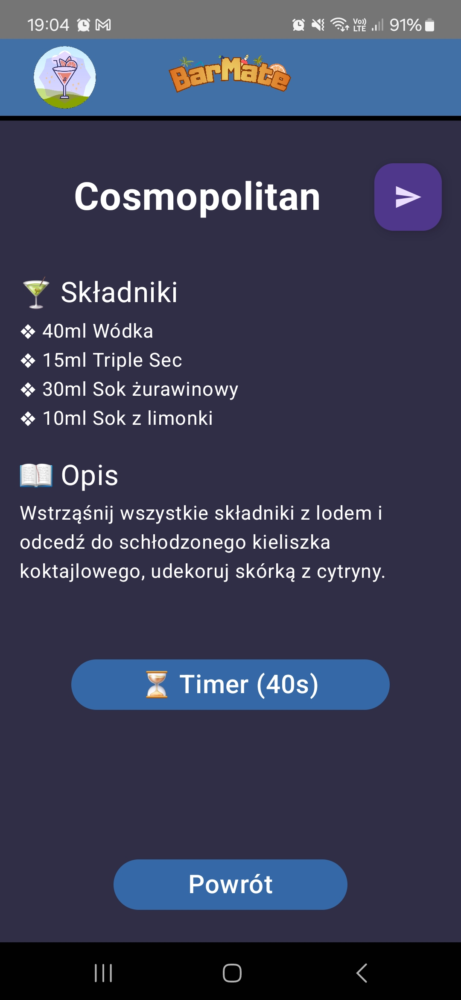
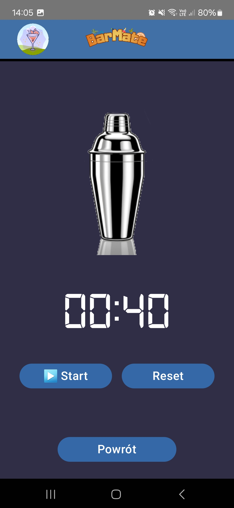

  

## 📖 Spis treści

1. [Opis projektu](#l1)
2. [Główne funkcjonalności](#l2)
3. [Technologie i architektura](#l3)
4. [Interfejs użytkownika](#l4)

## 📋 Opis projektu

Aplikacja mobilna wspierająca użytkownika w przygotowywaniu koktajli, stworzona w Android Studio z użyciem języka Kotlin przy pomocy Jetpack Compose.

## 🛠️ Główne funkcjonalności
* Lista koktajli wraz z filtrowaniem po nazwie oraz po opcji „Ulubione” (gwiazdka), którą możemy przydzielić każdemu z koktajli znajdujących się na liście
* Szczegóły drinka wyświetlającego szczegóły, krótki opis przygotowania oraz posiada przycisk FAB wysyłający wiadomość ze składnikami na wybrany numer tel.
* Minutnik z ustawionym w lokalnej bazie danych czasem mieszania w shakerze zależnie od wybranego drinka z dokładnością do sekundy
* Wyświetlenie podstawowych informacji o aplikacji po kliknięciu w logo na pasku narzędzi aplikacji w formie wysuwanego alertu

## ⚙️ Technologie i architektura

Aplikacja wykorzystuje architekturę MVVM – logika biznesowa została oddzielona od warstwy interfejsu użytkownika. Model odpowiada za lokalną bazę danych utworzoną przy pomocy biblioteki Room (SQLite), ViewModel zarządza przepływem danych między bazą a interfejsem oraz przechowuje stan aplikacji (np. wybrane pozycje lub zakładki), co zapobiega utracie danych podczas obrotu ekranu lub minimalizacji aplikacji. Warstwa View, zrealizowana w Jetpack Compose, odpowiada za prezentację danych i dynamiczne odświeżanie UI.
Interfejs został dostosowany do orientacji poziomej i pionowej na telefonach (przedstawione na filmie) oraz tabletach, a także do trybu jasnego i ciemnego (light/dark mode), co wpływa na czytelność i estetykę aplikacji.
  

## 🖥️ Interfejs użytkownika 

  
📱 Ekran powitalny 

  

  
📋 Widok listy koktajli 

  

  
📇 Szczegóły drinka 

  

  
⌛ Mierzenie czasu (licznik) 

  

